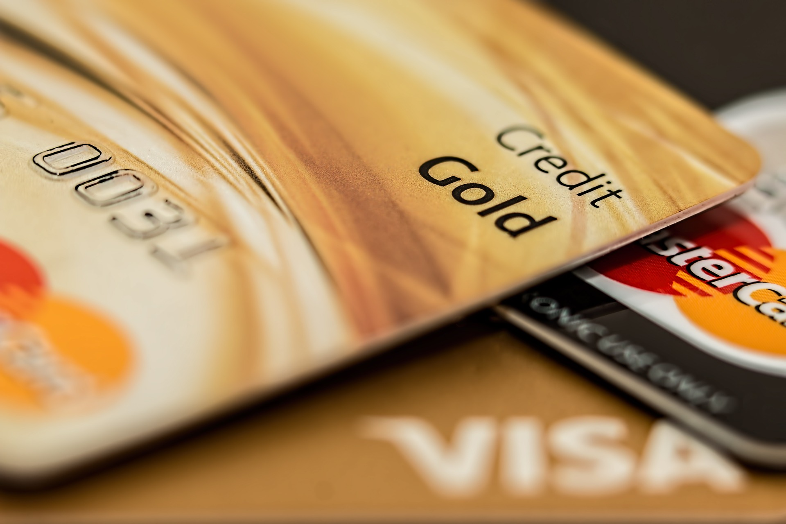

## Blancolån

Blancolån kan ses som ett samlingsnamn för flera olika typer av lån. Det innebär alla lån där man inte behöver sätta någon säkerhet för lånet. Exempel på typer av blancolån är konsumtionslån, kreditkonto, snabblån, smslån och minilån. Den här typen av lån har oftast en relativt hög ränta i jämförelse med ett traditionellt banklån eller bolån.

## Konsumtionslån

I lånebranchen finns många olika namn för ungefär samma sak. Ett konsumtionslån är ett blancolån, men man vill med namnet visa att det kan användas till konsumtion. Att konsumera innebär att handla saker. Om du hittat ett kap på rean som infaller två dagar före lön så kan det löna sig att ta ett konsumtionslån för att köpa den produkten. Räkna på det innan så att det verkligen lönar sig. Betala tillbaka lånet så fort pengarna finns på kontot.

## Högkostnadskrediter

Ett annat samlingsnamn för det som ligger inom ramen för blancolån. Med namnet högkostnadskrediter vill man fokusera på att det är en kredit med hög ränta eller hög kostnad generellt. Ta därför inte för många lån av den här typen och betala av dem så snart det är möjligt.

## Kreditkonto

Den här låneformen slog igenom ordentligt i september 2018 i och med nya lagar kring lån. De nya lagarna innebär bättre villkor för konsumenterna. Långivarna såg då att kreditkonto blev en enkel lösning.

I praktiken innebär ett kreditkonto att kunden bara ansöker en gång på en lite större kreditgräns. När den är godkänd kan man plocka ut så mycket pengar man behöver från kontot, men upp till den kreditgräns man har fått.

## Små lån

Alla små lån som listas här är blancolån. Ingen säkerhet för lånet behövs och räntan är högre. De kallas olika saker beroende på vad man vill trycka på. Ett litet lån ser vi som ett lån upp till 15000 kr, även om vissa erbjuder högre belopp än så.

### Snabblån

Oftast ett litet lån på under 15000 kr. Fokuset ligger på att man ansöker snabbt, får besked snabbt och får pengarna snabbt på kontot. I det hela taget så kan man få pengarna samma dag som man ansöker. Det gäller även andra lån, men med namnet snabblån förtydligar man det ytterligare.

### Smslån

Jag vet nu inget lånföretag som erbjuder smslån. Däremot finns namnet fortfarande kvar. Istället för SMS så har allt flyttat ut på webben. Majoriteten av befolkningen har smarta telefoner med internet och då finns ingen anledning att fortsätta med gammal teknik som SMS.

Det finns flera företag som fortfarande marknadsför sig som smslån men de hänvisar sedan till ett webbformulär istället.

### Mikrolån

Ett namn som ibland används för att beskriva samma typ av lån som snabblån, blancolån och smslån. Mikrolån användes ursprungligen i tredje världen för småföretagen där. Sedan har innebörden av namnet förändrats med tiden.

### Minilån

Ett av de mindre vanliga namnen för ett litet blancolån är minilån. Det förekommer ibland men är inte alls lika vanligt som smslån och snabblån. Mini står för att det är ett litet lån.

## Stora lån

En fördel med ett större lån är att räntan i procent oftast är lägre än ett blancolån. Storleken på ett större lån kan variera men det kan handla om lån på 30 000 kr upp till 300 000 kr eller mer, som ett exempel.

### Privatlån

Ett privatlån innebär att man använder lånet till sig själv, inte till sitt företag eller någon annan. De stora bankerna kallar lånet ofta för ett privatlån och man kan då använda pengarna till vad man vill. Eftersom lånet är stort går det att köpa bil eller renovera för pengarna.

## Företagslån

Man skulle kunna säga att ett företagslån är motsatsen till ett privatlån. Det används till att starta upp ett företag eller för att göra en större investering i företaget. På Jiddra så erbjuder vi i dagsläget ingen jämförelse av företagslån.

## Studelån

Det kan kallas både för studielån och CSN-lån men det är i praktiken samma sak. Om du ska låna till studier, gör det alltid via CSN eftersom räntan där är väldigt låg. Man betalar också av den under en väldigt lång tid. På [CSN](https://www.csn.se/fragor-och-svar/hur-lange-ska-jag-betala-pa-mitt-lan.html) står det att maximala löptiden för lånet är 25 år.

## Bolån

Bolån eller bostadslån. Det kallas lite olika saker men bolån är nog det vanligaste. Som namnet avslöjar så används lånet till att köpa en bostad. Det bästa man kan göra är att ta ett möte med sin bank och fråga efter ett bolånelöfte. Om det blir beviljat anser banken att man kommer att ha råd att betala tillbaka lånet. Om du går till en bra bank så är räntan för bolån låg i förhållande till många andra lån.

Om det inte blir beviljat så går det såklart att ta ett blancolån istället, men eftersom räntan är högre kan det bli väldigt dyrt så det är inget jag rekommenderar. Avvakta istället tills du får ett bolånelöfte beviljat.

<!--

## Bottenlån

## Topplån

-->

## Samlingslån

Om du har flera lån med hög ränta så finns en möjlighet att sänka räntan genom att baka ihop dem till ett samlingslån. Att samla lån kallas ibland också för hopbakslån. I programmet Lyxfällan är en vanlig lösning på för höga skulder att baka ihop alla lån och krediter genom ett samlingslån.

## Medlemslån

Om du är fackligt ansluten kan du ta ett medlemslån. I dessa fall kan det krävas att du är medlem i ett LO-förbund eller ett SACO-förbund. Om du är medlem i ett sådant förbund kan du med fördel se om ett sådant lån kan vara rätt för dig, då det kan innebära flera fördelar.

## Fordonslån

Fordon är bland det dyraste man kan köpa. Många har inte pengar till att köpa ett fordon med handpenning utan ett lån behövs om man inte vill vänta. Vid köp av ett fordon är privatlån den vanligaste lånformen.

### Billån

Vid köp av bil är det någon form av privatlån som är det mest vanliga. Ett bilköp är så pass vanligt att vissa långivare har skapat speciella billån med tydliga villkor för just lånet för bilen, som i grunden fortfarande är ett privatlån i grunden.

### Båtlån

Båtlån är inte lika vanliga som billån, då båtar inte säljs lika ofta. Alla behöver inte ha en båt. Ändå har vissa lån-företag skapat en variant av privatlån som de kallat för båtlån.

### MC-lån

Det finns inte så många MC-lån som det finns billån. Om du ska låna till en MC så är det ett privatlån du bör välja. Då det är ett stort köp, jämför kostnader mellan olika långivare först för då kan du spara tusenlappar.

## Seniorlån

Enligt [Pensionsmyndigheten](https://www.pensionsmyndigheten.se/nyheter-och-press/pressrum/seniorlan-fortsatt-dyr-affar-for-konsumenten) finns det två typer av seniorlån. Du kan läsa mer om de olika typerna där. Det är inte säkert att ett seniorlån är det billigaste alternativet. Jämför därför alltid för att hitta det lån som gynnar dig bäst.

## Peer-to-peer lån

Den här typen av lån innebär att vissa privatpersoner tar lån hos en långivare och andra lånar ut pengar till samma långivare. I praktiken blir det så att man lånar pengar av varandra. Den som lånar ut får en liten del av inkomsten och långivaren tar också en del av inkomsten.

En fördel för långivaren är att det för dem inte krävs ett enormt kapital i början att låna ut. En annan fördel är att de som lånar ut pengar också kan tjäna pengar, ibland mer än att sätta in pengar i en traditionell bank.