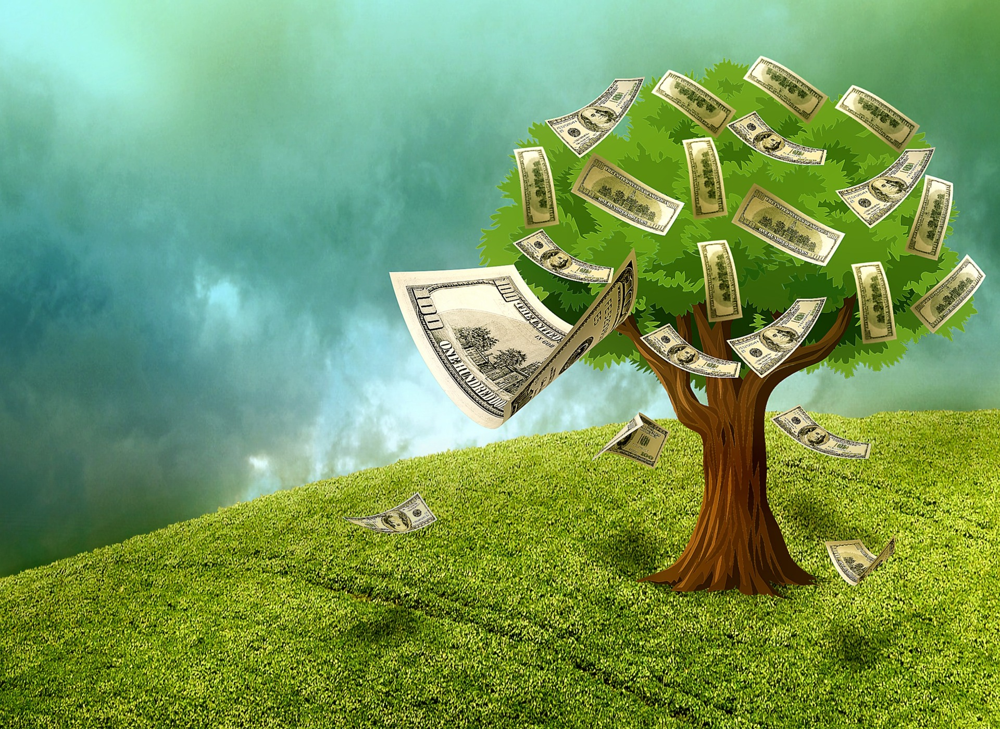
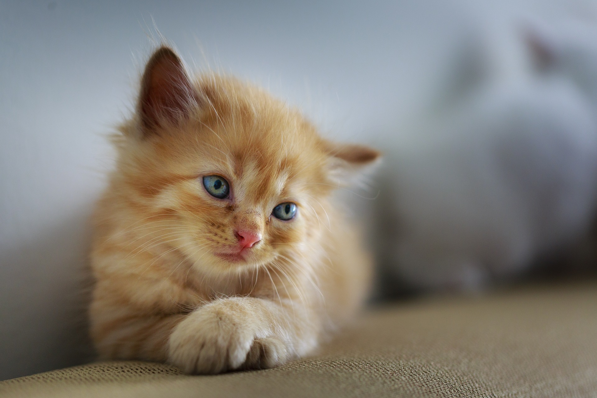

Om man lever ett liv där intäkterna är mindre än kostnaderna varje månad och man har en bra lön, så kan det vara så att man lever ett mer lyxigt liv än man har råd med. Det finns speciellt vissa områden som är extra vanliga att fastna i.

I TV-programmet Lyxfällan förekommer alla de lyxfällor jag kommer att beskriva. Om du saknar någon vanlig lyxfälla så får du gärna höra av dig.

## Djur

Att äga ett eller flera djur är som att ha familjemedlemmar. Det är inte som med prylar att man bara kan sälja av dem hur som helst. Det är oftast väldigt känsloladdat om man måste göra sig av med en del av sin familj, sina djur.

**Förslag:** Det man kan tänka på för att undvika problemet med att behöva sälja djur som man inte har råd med, är helt enkelt att inte skaffa några. Tänk efter en extra gång innan du köper ett djur om du har råd att ha djuret under hela dess livstid. Kostnaden ligger i mat, vård, prylar och eventuellt försäkring.

### Husdjur

Ju fler husdjur man har, ju högre blir kostnaden. Optimalt ur ekonomisk synpunkt är att inte ha husdjur alls. Om det inte är ett alternativ, se till att skaffa ett mer lättskött och billigt husdjur. Större husdjur brukar vara dyrare i längden än små husdjur.

### Hästar

Att köpa en häst är ett stort ansvar. Man måste man avsätta mycket tid till hästen, vilket kan göra att man får mindre tid till ett arbete och i så fall blir inkomsten lägre. En häst äter mycket mat och prylarna är inte billiga. Bara sadeln man sitter på kan kosta många tusenlappar.

**Förslag:** Tänk efter innan du köper häst, så slipper du ta ett ångestladdat när du tvingas sälja den.

## Kroppen

Att hålla kroppen ren och snygg är såklart viktigt. Se över priserna på de produkter du använder. Gör du rätt bör de inte blir speciellt hög månadskostnad.

### Spa

Att gå på spa är lyx och det kostar en del pengar. Det är ingen mänsklig rättighet att gå på spa så har du problem med ekonomin, låt bli.

**Förslag:** Häll upp ett varmt bad hemma. Häll i lite skum, eller ställ fram ett doftljus för att höja stämningen. Det bör bli betydligt billigare än att gå på spa.

### Hårvård

Det finns enormt mycket man kan göra med håret. Man kan klippa sig, förlänga, permanenta, färga och bleka håret. Den gemensamma nämnaren är att allt det här kostar en hel del pengar. Att förlänga håret kan kosta många tusenlappar då det är en komplicerad procedur.

**Förslag:** Att klippa sig om man har långt hår kan vara ett måste. Gör det i så fall inte för ofta, håll ut så länge det går. Om du har väldigt kort hår, använd en hårtimmer hemma och gör det själv. Det sparar mycket pengar på ett år.

### Smink

Att ha lite smink hemma är kanske inte någon stor kostnad. Om man däremot har ett enormt utbud av produkter som man sedan kanske inte ens använder. Då är det ett slöseri med pengar. Vissa väljer även att gå till en stylist för att bli sminkad. Tar man det för vana så rinner pengarna snabbt iväg.

**Förslag:** Gör det själv och köp inte för många produkter som sedan inte används.

## Nöjen

På fritiden vill vi ha kul. Det finns olika sätt att ha kul på och vissa kostar mer än andra. Nöjesparker och konserter brukar kosta mycket pengar.

**Förslag:** Att bara vara ute i naturen är det billigaste sättet att spendera en ledig dag. Vilka turistmål finns i din egen stad? Kanske finns det event som är gratis. Museum är ofta gratis.

### Krogen

Utekvällar kostar i regel en rejäl slant. Många gånger betalar man inträde och när man väl kommit in så kostar både ölen och maten. Spelar man dessutom bort pengar så blir det ännu större hål i plånboken efteråt.

**Förslag:** Gå inte ut oftare än du anser dig ha råd med. Ät helst innan du går ut så sparar du inte matkostnaden. Drick ölen på förfesten så slipper du köpa alla öl på krogen sen.

### Resor

Är du skuldsatt så bör du inte resa, iallafall inte den typen som kräver flyg och hotell då detta kostar väldigt mycket pengar. Om du dessutom har ett jobb och du väljer att ta ledigt kan det innebära utebliven arbetsinkomst, såvida du inte har semesterdagar sparat.

**Förslag:** Istället för att stanna hemma kan du göra dagsutflykter. Åk med buss tidigt på morgonen någonstans och var iväg hela dagen för att komma hem på kvällen. Om du ändå känner att du måste resa, se över alla utgifter. Ta buss eller tåg istället för flyg. Bo på vandrarhem istället för hotell.

### Bilresor

Bil är dyrt. Att köpa bil kostar mycket pengar, men att ha bil kostar också mycket pengar. Försäkring, reparationer, besiktning, parkering och bränsle är löpande kostnader. Den kostnaden som går att påverka är bränsleförbrukningen. Varje gång du åker någonstans så kostar det pengar, även om det bara är till affären.

**Förslag:** Använd bara bilen när du verkligen måste. Annars ta cykeln, gå eller ta buss. I vissa fall kan det faktiskt vara billigare att åka buss än att ta sin egen bil, då både parkeringsplats och bränslet kostar. Är det riktig kris så se över om du behöver ha en bil överhuvudtaget.

## Shopping

När man handlar triggas hjärnans glädjesystem igång. Det kan göra att förnuftet försvinner. Att handla i butiker är ett lätt sätt att bränna pengar. Att handla på nätet kan vara ännu enklare då man bara klickar hem grejerna.

### Kläder

Många har kläder som intresse. Det går snabbt att komma upp i tusenlappar på kläder. Vissa har ett köpberoende som kan vara svårt att bryta.

**Förslag:** Undvik att lockas av "KÖP NU!"-erbjudanden. Fundera istället en dag extra innan du köper det du hittat i butiken. Det gör att hjärnan hinner reflektera över hur viktig produkten faktiskt är. Hur många tröjor har du i garderoben? Behöver du verkligen en till?

### Elektronik

När det gäller elektronik behöver man bara köpa en grej så kan man vara skuldsatt. Många gånger kostar elektronik väldigt mycket pengar. Det kan vara mobiler, plattor, datorer, TV eller ljudutrustning.

**Förslag:** Se till att du inte har några lån innan du köper nya grejer. En bra regel kan också vara att se till att du kan köpa prylen kontant. Om du inte kan det, så kanske du inte har råd i längden att avbetala den heller.

### Köp och sälj av bilar

Vissa tycker om att mecka med bilar. Det finns en idé om att man köper in en gammal bil, renoverar upp den och sedan säljer den. Det låter bra eftersom man då kan få ut mer pengar än man köpt bilen för. I alla de fall jag läst om fungerar det inte i praktiken. Kostnaden blir istället högre, bilarna blir inte färdiga och det blir flera bilar som bara står och inte används.

**Förslag:** Sök ett jobb som bilmekaniker så kan du reparera bilar dagligen. Om du verkligen vill prova att renovera upp en egen bil, arbeta bara med en bil åt gången tills den blir klar och såld innan du påbörjar nästa. Annars hamnar du lätt i en ond spiral.

## Spelmissbruk

Ett spelmissbruk kan lätt förstöra någons liv. Problemen här är flera. Man köper ingenting fysiskt så om det går dåligt med spelandet så finns det ingenting kvar att sälja.

### Internetspel

Senaste tiden har casino, betting och poker vuxit rejält i Sverige. Dessa bolag tjänar väldigt mycket pengar. Den största faran är att man snabbt kan förlora väldigt stora belopp.

**Förslag:** Försök aldrig vinna tillbaka pengar som du har förlorat. Det fungerar inte så. Det är uträknat så att spelbolagen tar en stor del. Ett annat tips jag kan ge är att om du ska spela, bestäm i förväg hur mycket pengar du ska spela upp. Överstig sedan inte det beloppet oavsett om det gick dåligt eller bra.

### Spel på krogen

Spel på krogen är ett vanligt nöje. Det som påverkar att folk spelar mycket i det här fallet är alkoholen. Den gör så att de naturliga spärrarna släpper.

**Förslag:** Satsa små belopp hela tiden så räcker pengarna längre och du kan spela fler gånger. Ta inte med dig för mycket pengar till krogen.

## Kost

Äta sig tjock vet alla att det går, men går det äta sig fattig? Ja, tyvärr så är det inte så svårt. Det finns många dyra produkter men också produkter som konsumeras väldigt enkelt.

### Chips och godis

Båda chips och godis saknar näring, så det är inget som kroppen behöver. Många gånger äter vi det för att vi blir lurade av kroppen som egentligen vill ha energi. Suget hamnar därför på snabb energi som inte är så bra långsiktigt.

**Förslag:** Byt ut godis mot frukt och grönt. Då får du i dig rätt sorts näring. Byt ut chips mot en macka så blir du mättare. Dessa åtgärder bör få ner priset en del samt att du mår bättre.

### Cigg och snus

Alla vet att både cigg och snus är beroendeframkallande och inte så hälsosamma produkter. Ändå fortsätter många att använda dem. Det är dessutom dyrt och tillför inte kroppen någonting.

**Förslag:** Börja aldrig med cigaretter eller snus, så blir du aldrig beroende. Om det tåget redan har gått så försök att sluta. Ät en morot varje gång du är sugen på en cigg.

### Pizza och annan hämtmat

Mycket av hämtmat är inte så hälsosam. Den är inte så billig heller. Det som kostar är dels ingredienserna, men också personalen som har lagat maten. Enligt min egen beräkning är hämtmat generellt minst dubbelt så dyr som hemlagad mat.

**Förslag:** Räkna ut hur mycket hämtmaten kostar dig per år. Ser du en hög siffra kanske du får en aha-upplevelse och tänker om. Ifall det är tråkigt att laga mat, gör alla rätter på söndagen så kan du bara tina upp dem under kommande veckan.

### Läsk och energidryck

Inte heller läsk eller energidryck är speciellt bra av hälsoskäl. De ser inte ut att kosta speciellt mycket heller. Faran här är hur mycket man konsumerar. Energidryck hälls ofta upp i små burkar vilket gör att priset per centiliter blir högt.

**Förslag:** Räkna ut literpriset och fundera över om det är värt det. Båda dessa går att byta ut mot vatten eller mjölk.

## Sammanfattning

Det finns en röd tråd genom hela den här artikeln. Först och främst, har du tillräckligt med pengar för att köpa produkten? Om det inte finns, lägg inte upp en avbetalningsplan utan vänta istället tills pengar finns. Behöver du produkten eller har du redan en liknande hemma som fungerar bra? Om inte, finns det billigare alternativ? Om det är något som kostar varje månad, var då uppmärksam på det och ta reda på vad årskostnaden blir. Handla aldrig på impuls utan vänta tills dagen efter.