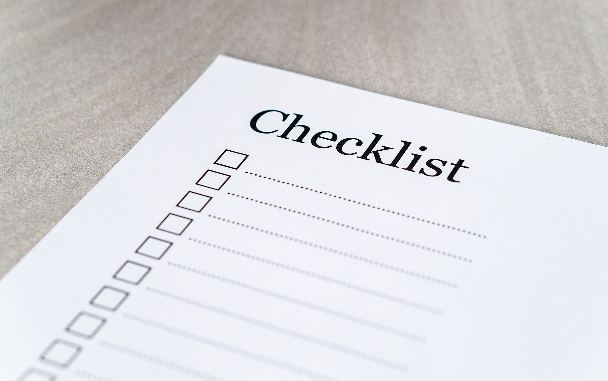
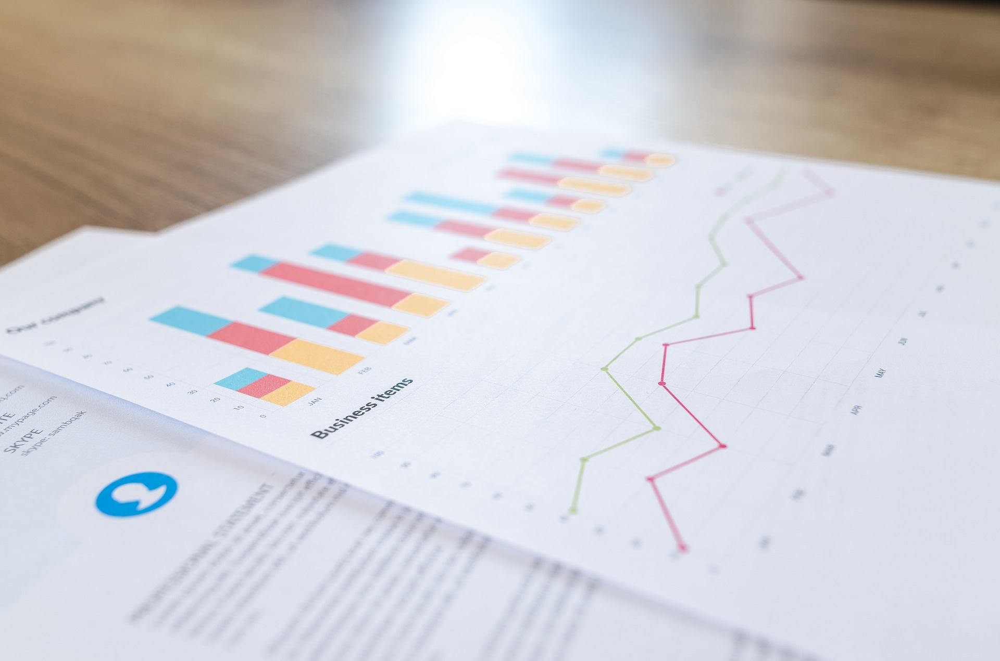

För att skriva den här artiklen har vi använt oss av [Hallå Konsument](https://www.hallakonsument.se/klaga-angra-eller-anmala/vad-lagen-sager/konsumentkreditlagen/) som är en jättebra känna för vilka rättigheter en konsument har.

## Ångerrätt

Från dagen då låneavtalet börjar gälla har du 14 dagar på dig att ångra avtalet. Observera att även om du ångrar dig behöver du betala tillbaka räntan på de lånade pengarna.

En långivare som tagit ångerrätten ett steg längre är [Loanstep](loanstep). Förutom ångerrätten erbjuder de (när detta skrivs) 14 dagars räntefritt lån vilket innebär att den ränta du annars skulle betalat, står Loanstep för. Du kan alltså låna ett belopp i upp till 14 dagar helt utan kostnad.

## Högkostnadskredit

Ett dyrare typ av lån, kallas för högkostnadskredit. Det är oftast ett blancolån som inte kräver någon säkerhet så som snabblån och smslån.

Om lånet har en årsränta på 29,5-39,5% så krävs att långivaren informerar om att det är en högkostnadskredit. Detta för att de som tar lån ska vara medvetna om risken med att lånet kan bli dyrt att betala tillbaka. Regeringen vill att färre ska hamna i skuldfällan.

**Källa:** [Hallå konsument](https://www.hallakonsument.se/klaga-angra-eller-anmala/vad-lagen-sager/konsumentkreditlagen/)

## Lån får inte kallas för gratis

Under en period var det många som erbjöd så kallade gratis smslån. I majoriteten av fallen var det lån där ingen kostnad behövde betalas när man lånade första gången.

Eftersom gratis innebär att ingen motprestation krävs fick man inte längre kalla lånet för gratis. Motprestationen i det här fallet är att lånet måste betalas tillbaka, dock utan avgifter. Istället döpte långivarna om lånet till räntefritt lån eller räntefritt smslån, men i praktiken är det fortfarande samma sak.

Läs hela artikeln om [Gratis smslån](https://jiddra.se/rantefritt) för mycket mer information.

## Räntetak

Med räntetak innebär att den ränta du betalar inte får överskrida en viss procent. Enligt lagen som kom 1 september 2018 får långivarna inte erbjuda lån som har en högre årsränta 39,5%. Lånföretagen kan alltså inte ta ut hur hög ränta som helst, vilken gör situationen lite tryggare för dig. Självklart bör du alltid sträva efter att ta ett lån med så låg ränta som möjligt.

**Källa:** [Konsumentverket](https://www.konsumentverket.se/aktuella-konsumentproblem/nyheter-och-pressmeddelanden/nyheter/2018/snabblan-far-bade-rantetak-och-kostnadstak/)

## Kostnadstak

Förutom räntetaket som jag skrev om i föregående kapitel finns även ett kostnadstak. Det nya lagstadgade kostnadstaket är sedan 1 september 2018 satt till dubbla beloppets storlek.

Så vad innebär det då? Jo, om du lånar 5000 kr så behöver du maximalt betala tillbaka 5000 kr + 5000 kr = 10000 kr. De första 5000 kr är då lånedelen som du betalar tillbaka. Den andra delen på 5000 kr innehåller exempelvis räntekostnad, aviavgifter, uppläggningsavgift, uttagskostnader och årsavgifter.

Det lån du tar behöver inte kosta så mycket som jag beskrev ovan och jag rekommenderar dig att välja det lån som innebär lägst kostnad för dig. Vilket lån det är beror hur mycket du ska låna och vilka krav långivaren ställer på dig som lånar.

**Källa:** [Konsumenternas](https://www.konsumenternas.se/aktuellt/rantetak-och-kostnadstak-for-snabblan-och-andra-hogkostnadskrediter)

## Kreditprövning krävs alltid

Regeringen vill förhindra att folk skuldsätter sig och hamnar i en ond spiral. Därför sätter de press på långivarna gällande den kreditprövning som görs innan ett lån tas.

Med kreditprövning innebär att lån-företaget kontrollerar att personen har möjlighet att betala tillbaka lånet. Oftast kontrolleras om personen har ett jobb och vad årsinkomsten ligger på. En hel del andra parametrar kan också vävas in för att skapa en samlad bedömning. Finns betalningsanmäkrningar? Har personen hamnat hos Kronofogden?

Vissa långivare lånar ut trots betalningsanmärkningar, men en kreditprövning görs alltid då det är inskrivet i lagen. Olika lån-företag bedömer dock lite olika så därför kan du få lån hos ett ställe men få avslag hos ett annat.

Vissa gör kreditprövningen med UC (Upplysningscentralen). Nackdelen med UC är att du då hamnar i deras register och det kan göra det svårare att få andra lån eller så senare. Därför är det vanligt att Creditsafe eller Bisnode används istället då de inte för register på det sättet.

**Källa:** [Regeringen - Effektivare förbud vid bristande kreditprövning](https://www.regeringen.se/pressmeddelanden/2016/03/effektivare-forbud-vid-bristande-kreditprovning/)

## God kreditgivningssed

Med god kreditgivningssed innebär i praktiken att företaget ska vara rak och tydlig i sin information till dig. De ska inte dölja något, de ska inte med flit försvåra någon information och de ska inte heller försköna sin egen tjänst. De bör också vara hjälpsamma och se till kundens bästa.

Ett lån kan ha både för och nackdelar. Att därför måla upp en förskönad bild av allt det positiva och samtidigt utelämna det negativa (som kostnader) är inte så god kreditgivningssed.

Den här lagen är löst skriven. Vart gränsen går avgörs därför från fall till fall.

**Källa:** https://www.hallakonsument.se/klaga-angra-eller-anmala/vad-lagen-sager/konsumentkreditlagen/

## Du har rätt till ditt avtal

När du väl har skrivit på ett avtal, kanske signerat det med e-leg så har du också rätt till det. Kanske får du avtalet hemskickat eller som PDF via ett mail. Vissa kanske har byggt en tjänst där du kan logga in och hämta ditt avtal. Det viktiga är att du får ett avtal och kan begära ut det ifall du behöver det.

I vissa fall kan det vara så att du har glömt vad du har signat upp dig på och då är det värdefullt att kunna få avtalet igen. Om du inte får avtal på begäran, var då försiktig med betalningen så att du inte har råkat ut för ett bluff-företag som skickat en faktura till dig.

**Källa:** https://www.hallakonsument.se/klaga-angra-eller-anmala/vad-lagen-sager/konsumentkreditlagen/

## Du kan betala lånet tidigare

Om du har lånat pengar av ett företag, kanske med lång löptid och upptäcker att kan betala av lånet tidigare så går det bra. Enligt lag ska alla långivare erbjuda den möjligheten.

Fördelen med att betala ett lån innan löptiden gått ut är att det blir billigare ränta. Ta därför för vana att alltid betala av lånet så snabbt du kan. Enligt lag kan en långivare inte ta ut ränta för de dagar som är kvar av lånet om du redan har betalat av det.

Dock kan det vara så att långivaren har skrivit in i avtalet att räntan är bunden och det innebär andra förutsättningar. I det fallet kan de ta ut en så kallad ränteskillnadsersättning för återstående löptid. Den kostnaden får aldrig vara högre än vad räntan skulle ha kostat om du inte betalat lånet i förväg.

**Källa:** [Konsumenternas - Säga upp lån](https://www.konsumenternas.se/lana/olika-lan/om-konsumtionslan/sa-fungerar-ett-lan/saga-upp-lan)

## Tillstånd från Finansinspektionen krävs

[Finansinspektionen](https://finansinspektionen.se/sv/) håller koll på de företag som arbetar med lån och annat som är finansrelaterat. Enligt en lag som trädde i kraft 2014 måste alla företag som lånar ut pengar vara registrerade och ha tillstånd att driva sin verksamhet, av Finansinspektionen.

Om du är osäker på om företaget du hittat är registrerat kan du söka efter det i deras [Företagsregister](https://finansinspektionen.se/sv/vara-register/foretagsregistret/). I fritextsök kan du söka på företagsnamnet. En nackdel med det är att webbplatsen ibland heter något helt annat än deras registrerade bolag. Därför är det lättare att få träff om man vet deras organisationsnummer.

Företagen som lånar ut pengar står därför under tillsyn av både Finansinspektionen och Konsumentverket.

**Källa:** [Finansinspektionen - Låna](https://www.fi.se/sv/konsumentskydd/fragor-och-svar/lana/)

## Effektiv ränta måste anges

Enligt lag måste den effektiva räntan anges av långivaren. Den ska vara tydlig och får inte vara mindre tydlig än den text som finns runt.

Ett annat krav är att den effektiva räntan ska ingå i ett räkneexempel där det står beloppet och den effektiva räntan, samt vad kostnaden blir. Detta för att kunden tydligt ska veta vad lånet kostar utan att behöva räkna själv.

**Källa:** [Konsumentverket - Informera om den effektiva räntan](https://www.konsumentverket.se/for-foretag/regler-per-omradebransch/finansiella-tjanster/krediter/marknadsforing-av-kredit/)

## Sammanfattning

Det finns en mängd lagar och regler som långivarna måste följa för att få låna ut pengar. Ju fler år som går, ju fler lagar tillkommer. Majoriteten av alla lagar är till för konsumentens bästa, för att undvika att alltför många personer hamnar i en skuldfälla.

De viktigaste lagarna som jag ser det är följande; Att kostnaden för lånet aldrig får överstiga lånebeloppet, att en kreditprövning alltid krävs, att du har rätt till ditt avtal, att långivaren måste vara tydlig med alla sina kostnader, att du kan betala av lånet tidigare och att alla långivare måste ha tillstånd från Finansinspektionen för att få driva sin verksamhet.