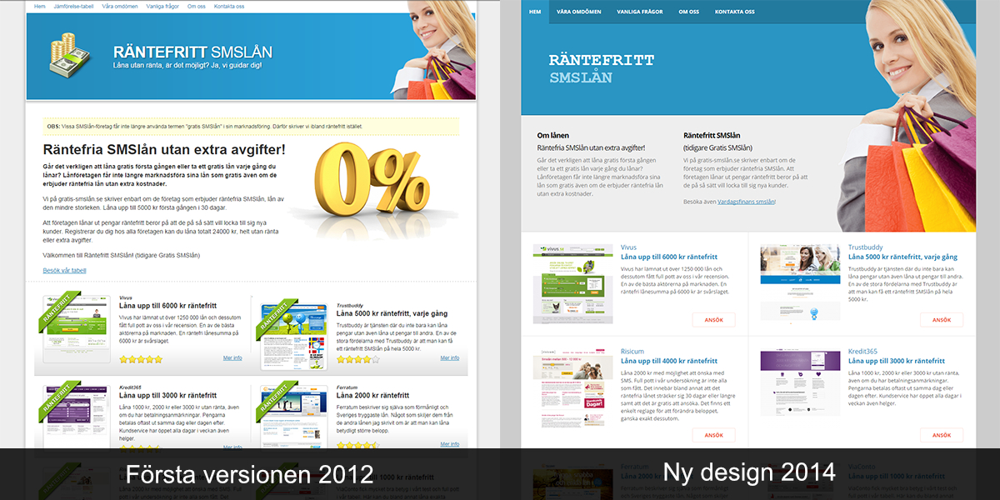
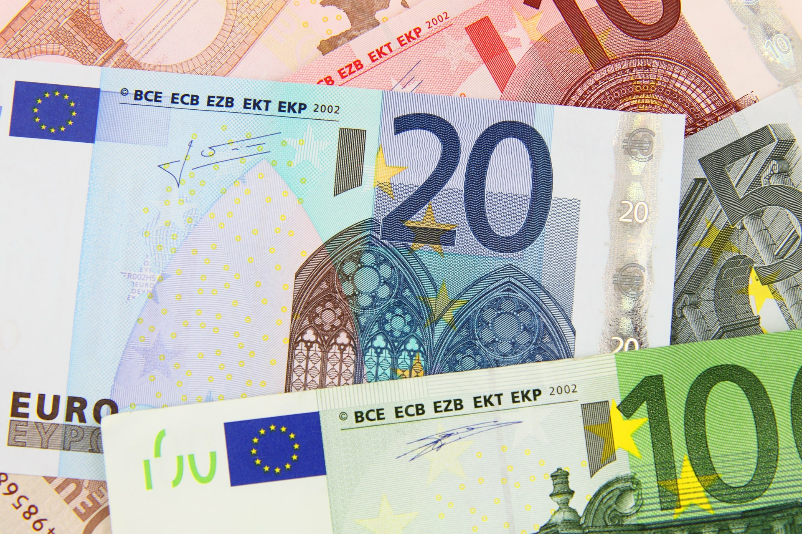

I den här artikeln får du veta varför man inte får marknadsföra ett lån som gratis. Du får veta skillnaden mellan ett gratis smslån och ett räntefritt lån, men också varför majoriteten av alla räntefria lån helt har försvunnit från marknaden.

<!--
Före 1 september 2018 fanns det många företag som erbjöd räntefria lån. Efter den nya lagen, har en stor del av dessa försvunnit. Detta eftersom många som erbjöd räntefritt lån tidigare nu istället erbjuder kreditkonto. Ett kreditkonto fungerar på ett annat sätt.
-->

## Gratis smslån

För ett antal år sedan var det väldigt många långivare som erbjöd vad de då kallade för gratis smslån. Det var ett populärt sätt att få en potentiell kund att teckna ett låneavtal med långivaren. Tröskeln blev på så sätt lägre då inga kostnader tillkom på den här nya typen av gratis lån.

### Kostnad för gratis smslån

Som man hör på namnet "gratis" så kostade inte lånet någonting.

**Exempel på kostnader:**

- 0 kr i uppläggningsavgift
- 0 kr i aviavgift
- 0 % i ränta

Som ett exempel på detta; om lånet är på 5000 kr så är det 5000 kr som du ska betala tillbaka. Alltså inga extra kostnader tillkommer.

### Gratis lån gynnade långivarna

Vad tjänar företaget på ett lån de inte får in några pengar på? Jo, de får en ny kund som de kan tjäna pengar på i ett senare skede.

Att ta steget från att inte vara kund kan bli kund kan vara stort. En potentiell kund kan backa av flera orsaker. Det kan verka jobbigt att fylla i formuläret, det kanske är svårt att bilda sig en uppfattning om vad lånet kostar eller så kan det bero på att lånet helt enkelt är för dyrt.

Om man förenklar och förbättrar genom att säga att lånet är gratis och det enda du behöver göra är att fylla i formuläret, då kommer fler att vilja ta ett sådant lån. Tröskeln har då blivit betydligt lägre.

När besökaren blivit kund så är vissa trösklar. Kunden vet hur man ansöker och hur hela processen går till. Då är chansen större att de väljer samma långivare igen nästa gång, även om det då kostar pengar.

### Får inte kalla det gratis smslån

Efter en tid med flera företag som haft gratis smslån kom ett slags förbud mot detta. Man fick erbjuda ett lån utan ränta, men kalla det för gratis. [@cashoo - Medium](https://medium.com/@cashoo/vad-inneb%C3%A4r-egentligen-lagen-om-god-kreditgivningssed-5813c6aa24e1) skriver mer om det i sin blogg.

Det finns en viktig skillnad mellan gratis och räntefritt. Ett räntefritt lån innebär helt enkelt att man inte behöver betala någon ränta. När något är gratis innebär det att en motprestation inte krävs. I det här fallet krävs en motprestation, eftersom lånet måste betalas tillbaka. För mer detaljer om ordet gratis kan du läsa på [Wikipedia - Gratis](https://sv.wikipedia.org/wiki/Gratis).

Det innebar att webbplatserna fick ändra sitt sätt att marknadsföra sin produkt. Istället för att skriva "gratis" så skriver de nu "räntefritt". I praktiken var produkten fortfarande densamma.

Gratis-lånet erbjöds bara vid första tillfället. Om lån skulle tecknas från samma långivare igen så tillkom kostnader. Därför kunde det vara en fördel att byta långivare efter första gången för att på så sätt låna gratis flera gånger om. Dock kunde det vara en risk om pengar saknas när lånen skulle betalas tillbaka.

För en mer generell lista besök [Vardagsfinans smslån](https://vardagsfinans.se/smslan)!

### Slutet för gratis-smslån.se

Innan vi byggde Jiddra hade vi webbplatsen gratis-smlån.se. Den fungerade bra och blev snabbt väldigt populär. Efter att man inte längre fick marknadsföra lånen som gratis fick vi ändra alla texterna på webbplatsen och anpassa dem efter de nya reglerna.

Nuförtiden används inte smslån lika mycket som tidigare, eftersom i princip ingen erbjuder ansökan per sms längre. Så både "gratis" och "smslån" är två ord som antagligen förr eller senare helt kommer gå ur tiden. Domän-namnet klingade inte längre lika bra som tidigare.

Det största skälet till att stänga webbplatsen var att det fanns för få räntefria lån kvar, i och med den nya lagen som kom 1 september 2018. I slutet  fanns bara tre stycken långivare på gratis-smslån.se vilket också gjorde att trafiken sjönk.

På grund av skälen ovan har webbplatsen pekats om till den här sidan.

## Räntefritt lån

Som jag skrev ovan så innebär ett räntefritt lån att ingen ränta läggs på lånet. De flesta långivare erbjuder detta lägger inte på andra avgifter som exempelvis uppläggningsavgift. De vill helt enkelt knyta nya kunder till sig utan att i ett första läge börja kräva kunderna på pengar. Lånar du däremot mer än en gång tillkommer ränta som vanligt.

### Skillnad mellan gratis och räntefritt

Skillnaden mellan gratis smslån (som det kallades tidigare) och ett räntefritt lån är i praktiken ingen alls. I alla fall inte i det fallet varken ränta eller avgifter tillkommer vid första lånetillfället. Däremot måste du såklart betala tillbaka det belopp du lånade inom löptiden. Betalar du efter att löptiden har löpt ut riskerar du också kostnader som dröjsmålsränta eller påminnelseavgifter.

### Då ska du låna räntefritt

Ibland kan det vara en fördel att låna räntefritt i jämförelse med att ta en annan typ av lån. Det beror på att räntefria lån ofta är begränsade när det gäller belopp och löptid.

**Exempel på när det kan vara bra att låna räntefritt:**

- Det belopp du ska låna är lågt och ryms inom ramen för de räntefria lån som finns.
- Den löptid du ska låna är kort, i vissa fall så låg som 14 dagar.
- Du är noga med att alltid betala tillbaka lån i tid.
- Du behöver bara ett lån, eller kan tänka dig att ta ett lån från varje långivare som erbjuder räntefritt lån.

### Ta flera räntefria lån

I de flesta fall kan det vara dumt att dra på sig alltför många små krediter eftersom mindre lån generellt sätt är dyrare än större lån, men också att det blir flera uppläggningsavgifter och andra kostnader.

Då man väljer ett eller flera räntefria lån blir det dock en viss skillnad. Om de räntefria lånen inte innebär någon extra kostnad i övrigt och man därför inte betalar tillbaka mer än lånet så har man inte förlorat några pengar. Om det inte kostar något spelar antalet lån inte någon roll, kostnaden blir ändå noll. Observera att du bara lånar räntefritt första gången så om du ska ta flera lån måste du ta ett lån från varje långivare.

### Betala tillbaka lånet i tid

Vad som i det här fallet är mycket viktigt att tänka på är att betala tillbaka lånen i tid. Om du inte gör det så blir det antagligen dyrare då du har flera lån, eftersom det blir flera påminnelseavgifter från olika långivare på samma gång.

Sammanfattningsvis så kan det vara gynnsamt att ta flera räntefria lån från olika långivare samtidigt för att få upp lånets storlek och samtidigt inte få några kostnader. Glöm inte bort att betala lånet så fort du får in pengar igen.

### Låna andra gången

Vad som är viktigt att veta är att det räntefria lånet oftast bara gäller första gången. Om du tar ett lån till vid ett senare tillfälle från samma långivare så kostar det lånet pengar. Det är inte alla långivare som har det upplägget, men de allra flesta.

Vad du kan göra om du vill låna räntefritt igen är helt enkelt att välja en annan långivare som du inte redan tagit ett lån hos. Såklart måste även de erbjuda en räntefri variant av lånet för att det ska fungera.

## Nya lagen som ändrade allt

Som jag skrev i början kom en ny svensk lag 1 september 2018. Den innebär bättre villkor för låntagaren med bland annat både räntetak och kostnadstak. Även om det är bra för låntagaren så blir det samtidigt tuffare för de långivare som finns att få in de pengar de behöver för att bedriva sin verksamhet. Den vanliga äldre modellen för små krediter med kort löptid fungerar för många inte längre. Det är helt enkelt inte lönsamt för de flesta.

### Kreditkonto växte fram

Många långivare har löst problemet genom att skapa en ny tjänst som kallas för kreditkonto. Tidigare har det varit så att låntagaren har ansökt om nytt lånbelopp och ny löptid varje gång ett nytt lån ska tas. Med kreditkonto så ansöker låntagaren bara en gång om ett större kreditbelopp. Därefter kan låntagaren plocka ut pengar från kreditbeloppet när mer pengar behövs utan att behöva göra en ny ansökan.

Så hur påverkar detta det räntefria lånet? Nu finns inget första lån längre i den bemärkelsen då man ansöker om ett större kreditbelopp direkt. Därför kan långivaren inte ta betalt vid nästkommande lån. Det är för många inte lönsamt att bjuda på hela kreditgränsen.

### Få långivare kvar

Trots nya lagar och regler så har vissa få långivare fortfarande erbjudandet om räntefritt kvar. Det återstår att se om de kommer att fortsätta med det framöver men också om fler kommer tillbaka och börjar erbjuda det igen.

**Exempel på långivare som kör räntefritt:**

- [Loanstep](loanstep)
- [Ferratum](ferratum)
- [Meddelandelån](meddelandelan)

## Sammanfattning

Gratis smslån var en mycket populär tjänst eftersom det innebar att lånet inte kostade någonting. Ett gratis lån gjorde att fler besökare tog lån och därmed blev ny kund hos långivaren. För långivarens del innebar det att de kunde ta betalt på nästkommande lån eftersom bara det första lånet var gratis.

Efter en tid kom en lag som gjorde att man inte fick kalla lånen för gratis eftersom lånet behövde betalas tillbaka. Man får ju inte pengarna utan bara slipper kostnaden. Låneformen döptes om till "räntefritt" istället men i praktiken fungerar det lika dant.

När man tar ett räntefritt lån ska man känna till att bara första lånet är räntefritt om inget annat anges. Man måste också betala tillbaka lånet i tid för att gynnas av det.

Om man lånar räntefritt från flera långivare samtidigt kan man totalt få ut ett större belopp som fortfarande inte kostar något extra. Var försiktig eftersom du kan förlora mycket pengar om du inte betalar tillbaka innan löptiden går ut.

Vad tycker du om räntefria lån? Lämna gärna en kommentar!