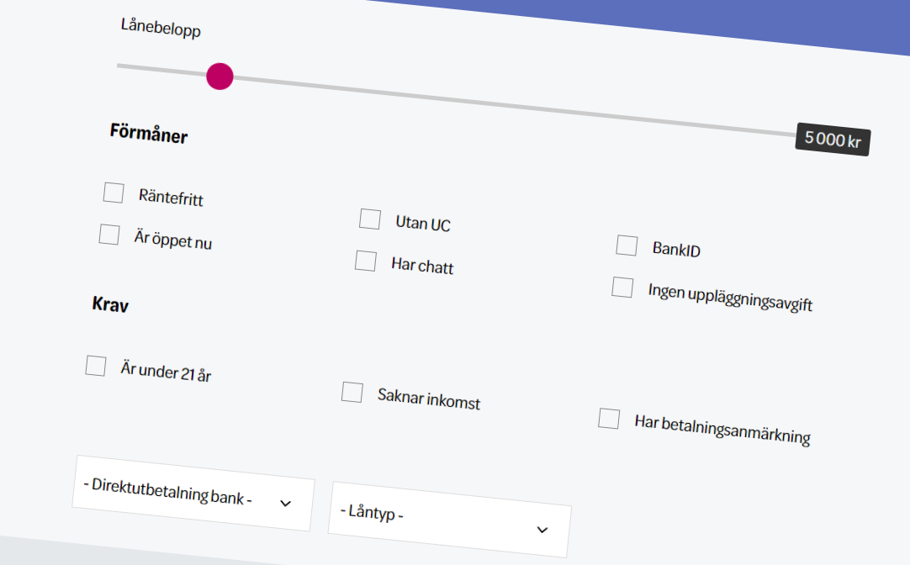
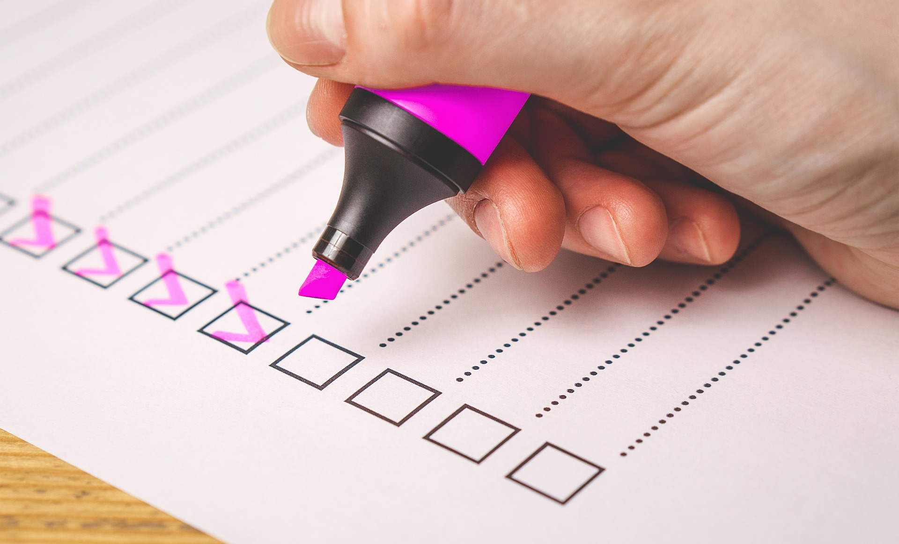

## Välj rätt långivare

Att veta vilka långivare som är bra kan vara svårt. Vissa har låga krav, andra har låga avgifter och vissa har längre löptid eller erbjuder större belopp. Det lån som är bäst för dig behöver inte vara bäst för alla.

### Jämför kostnader

Jag rekommenderar att ha kostnaden i fokus vid val av lån. Detta eftersom du kan behöva betala tillbaka på lånet en lång tid framöver och det kan skilja väldigt mycket mellan olika aktörer på marknaden.

### Vanliga kostnader

Det finns ett antal vanliga kostnader som tas ut av långivaren vid ett lån. Alla företag tar inte ut alla dessa avgifter och vissa tar inte ut någonting alls, förutom räntan.

#### Ansökningsavgift

Vissa tar ut en ansökningsavgift vid tecknandet av ett nytt lån. Det kan liknas vid en startavgift för lånet som bara betalas en gång. Den kan ligga på ett par hundralappar så är lånet litet så kan det vara en betydande del av den totala lånekostnaden.

#### Uppläggningsavgift

I princip samma sak som ansökningsavgift. Med uppläggning menas den kostnad som täcker arbetstiden för företaget att lägga upp lånet i sitt system. Även i detta fall kan avgiften ses som en startavgift för lånet som bara betalas en gång. Både ansökningsavgift och uppläggningsavgift förekommer inte. Inte vad vi kan erfara iallafall. Det som däremot är vanligt är att långivare väljer att skippa både ansökningsavgift och uppläggningsavift helt.

#### Nominell årsränta

För att räkna ut den nominella årsräntan tar man periodräntan och multiplicerar med 12, då det går 12 månader på ett år.

Om man vet den nominella årsräntan så kan man jämföra olika lån med varandra. Dock ska man vara lite försiktig eftersom det kan tillkomma andra kostnader som uppläggningsavgift och aviavgift. Därför är det inte helt rättvist att bara titta på nominell årsränta. Istället kan det i det fallet vara mer rättvist att jämföra den effektiva årsräntan som inkluderar alla kostnader.

#### Effektiv årsränta

#### Aviseringsavgift och aviavgift

När du får en faktura att betala så kan långivaren välja att ta ut en aviseringsavgift för detta. Det beror på att företaget anser att det blir en kostnad för dem att göra arbetet med att skapa, handhålla och skicka fakturan till dig.

Aviavgift påminner mycket om aviseringsavgift eftersom det även här är en kostnad som tillkommer för att skicka ut en faktura till dig. Skillnaden är att avi oftast syftar till utskickandet av fakturan snarare än det administrativa arbetet av det. Jag har aldrig sett att både aviseringsavgift och aviavgift tas ut, så långivaren väljer en av avgifterna att ta ut.

Det man som kund bör tänka på här är att alltid försöka få e-faktura eller autogiro. Det sänker nästan alltid den här kostnaden. Vissa långivare tar inte ut någon aviseringsavgift eller aviavgift alls.

#### Uttagsavgift

Det är långt ifrån alla som tar ut en uttagsavgift men det förekommer. Som man kan höra på namnet är det en avgift som tas ut varje gång man gör ett uttag. Kanske har du ett kreditkonto som du plockar ut pengar från när det behövs. Var i så fall försiktig om det tillkommer en uttagsavgift. I det fallet kan det löna sig att ta ut ett större belopp direkt för att bara behöva betala en uttagsavgift. Observera då att räntan kan bli högre så du får räkna på det innan, vilket du gynnas mest av.

### Använd ett verktyg

För att få reda på allt du behöver kring de olika långivare som finns kan du behöva en tjänst som hjälper dig att snabbt få en överblick. Ett sådant verktyg finns på https://jiddra.se/lan. Du jämför belopp, löptid, krav, kostnader och mycket annat. Du kan även filtrera på det som är viktigt för dig. På så sätt förmedlar vi ett lån till dig. Vi lånar inte själva ut pengar.

## Skicka in en ansökan

När du väl vet vart du ska låna behöver du skicka in en ansökan.

### Vanliga krav

Innan du skickar in din ansökan kan det vara bra att kolla upp om du uppfyller kraven. Även om du är osäker kan du såklart ansöka iallafall. De flesta tar inte ut någon avgift för att göra en ansökan.

#### Krav som alla ställer

- Du ska vara minst 18 år
- Du ska ha ett svenskt bankkonto
- Du ska ha bank-ID
- Du ska ha bott i Sverige i minst 2 år
- Du ska klara av att gå igenom en kreditprövning

#### Krav som vissa ställer

- Du ska vara minst 21 år
- Du ska inte ha några betalningsanmärkningar
- Du ska ha en årsinkomst på minst 150 000 kr

### Fyll i registreringsformuläret

På långivarens webbplats finns ett formulär att fylla i. Det är dina personliga uppgifter som ska fyllas i. De flesta långivare har väldigt höga krav på sin egen säkerhet och krypterar sin data så att den inte kan hamna på villovägar.

### Ha ditt bank-ID redo

Du kan vara beredd att använda ditt bank-ID eftersom du kan behöva legitimera dig med det. Om du saknar bank-ID så fråga din bank om hjälp så kommer du få den hjälp du behöver.

## Utbetalning av pengar

Efter att ha skickat in dina handlingar till långivaren är det inte så mycket mer du kan göra innan du fått pengarna på kontot.

### Långivaren tar en kreditupplysning

För att försäkra sig om att du kan betala tillbaka lånet så tas alltid en kreditupplysning. Det är nu inskrivet i lagen, så det kommer man inte undan. Många är oroliga för att de ska hamna i UC (Upplysningscentralen). UC är ett register som företag kan använda sig av för att kolla upp om du har lån sedan tidigare. Finns man med där kan det exempelvis vara svårare att få bolån.

Många tar inte UC eftersom det finns andra företag som också kan göra kreditupplysningar och dessutom utan att föra register på det. Creditsafe och Bisnode är två vanliga företag av den typen. Var därför uppmärksam på att försöka hitta ett lånföretag som inte tar UC om du vill undvika att hamna i UC-registret.

### Invänta besked

Efter att ansökan är inskickad är det bara att vänta. Ett besked kan ta olika lång tid men långivarna brukar försöka skicka ut det så snabbt som möjligt.

### Få pengarna på kontot

Att få pengarna brukar gå snabbt. Samma dag eller någon dag efter är det vanliga. Om du har gjort ansökan sent på fredagen kan det vara så att du får vänta tills veckan efter då det ligger en helg i vägen.

Om du har samma bank som långivaren kan du få pengarna snabbare. Vissa betalar ut pengarna även på helger. Kontrollera därför om företaget har samma bank som du om du behöver pengarna snabbt.

## Betala tillbaka

Att betala tillbaka pengarna är det absolut viktigaste steget i att ta ett lån. Om du inte gör det så kommer du få extra kostnader av långivaren i form av dröjsmålsränta eller påminnelseavgifter. Går det långt så får du inkasso-brev med ytterligare kostnader och kan i värsta fall hamna hos Kronofogden.

## Sammanfattning

Den här artikeln innehåller väldigt många steg så det kan verka svårt att ta ett lån. Det är inte så svårt, men vi har valt att gå igenom varje steg i processen.

Det som sker är att du först bör använda ett [verktyg](https://jiddra.se/lan) till att välja rätt långivare. Sedan om du uppfyller kraven skickar du in en ansökan och legitimerar dig med bank-ID. Efter det så väntar du på lånebesked och att få in pengarna på kontot.

Glöm inte att betala tillbaka lånet i tid!