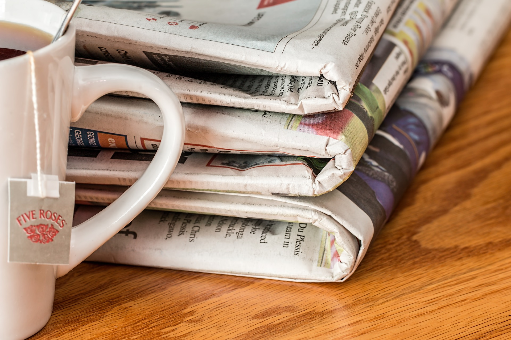

**Målet är att komma upp i 201 spartips. Vi är inte där än, men nya spartips läggs till hela tiden. Om du har något eget tips, dela gärna med dig i kommentarsfältet längst ner.**

## Undvik prenumerationer

Något som många har är någon form av prenumeration. Det kan vara exempelvis en tidning, bok-klubb eller musik-klubb. En prenumeration är en återkommande utgift. Att säga upp en prenumeration kan därför på sikt ha stor inverkan på ekonomin.

### Vanliga prenumerationer

För att du ska komma ihåg vilka prenumerationer du har finns här en lista på vanliga prenumerations-former. Saknar du någon i listan? Lämna gärna en kommentar.

### Tidningar

Det vanligaste är förmodligen att prenumerera på en eller flera tidningar. Kan man klara sig utan tidningen?

#### Fundera över följande:

- Kan du få samma information gratis någon annanstans, exempelvis via internet?
- Räkna ut vad tidningen kostar per år. Är värt att lägga dessa pengar på tidningen?

### Musik-CD

Det finns prenumerationer där man får en musik-skiva hem med jämna mellanrum. Går det klara sig utan prenumeration av musik?

#### Ställ dig följande frågor:

- Finns musiken billigare någon annanstans, exempelvis på Spotify, iTunes, eller på skiva i butik?
- Hur många av låtarna på CD-skivorna du får hem tycker du är bra?
- Hur mycket betalar du i prenumerations-kostnad per år? Är musiken värd det priset?

### Film

Precis som med musik-CD finns film som prenumerationsform. Att prenumerera på film och musik gör att man får ”grisen i säcken” och inte har möjlighet att välja själv vad man tycker om.

#### Tänk över dessa punkter:

- Går det se på film billigare? Idag finns många internet-tjänster för film. Det går också se dem på bio.
- Tycker du alla filmer du har fått hem är bra? Hur många i så fall och räcker det för att vilja fortsätta prenumerationen?
- Vad kostar prenumerationen årsvis? Är det värt det eller vill du hellre använda pengarna till något annat?

### Böcker

Det går att prenumerera på böcker också i en bok-klubb eller liknande. Du får böcker men inte exakt de böcker du själv skulle ha valt, eller hur?

## Gå eller cykla

Att gå eller cykla dit man ska är både bra för miljön och för plånboken. Dessutom är det bra för kroppen då det ger gratis motion.

### Gå

Om det inte är alltför långt dit man ska kan gå vara det bästa sättet att ta sig dit. Upp till 5 kilometer är ganska lagom långt. Blir det längre än så kanske man bör fundera på att ta cykeln istället, men det beror också på vilken typ av person man är.

### Cykla

Korta eller medellånga sträckor kan man med fördel cykla till istället för exempelvis åka buss eller taxi. Om sträckan är längre än 1 mil så kanske börjar bli jobbigt att cykla.

## Panta burkar

Om du handlar mycket dricka på burk, glasflaska eller PET-flaska så kan du spara en del pengar på att återlämna dessa till en pantcentral.

### Produkter att panta

#### Panta burkar

Du får tillbaka 50 öre till 1 krona beroende på vad det står på burken.

#### Panta glasflaskor

Det går att panta en flaska eller en hel back. Dricker man mycket är det mest fördelaktigt att ta med sig pant-flaskorna backvis.

#### Panta PET-flaskor (plast)

För de små PET-flaskorna får du 1 krona och för de stora 2 kronor.

### Panta andras förpackningar

Vill du få ut mer än vad dina egna dryckesförpackningar ger så kan du ge dig ut på stan. Där finns mycket pant att hitta. Det är speciellt populärt att samla pant på festivaler eller andra festligheter då insamligen snabbt ger mycket pengar.

## Släck lamporna

Släck lamporna som du inte använder. Det sparar både miljö och pengar. Det är vanligt att man tänder upp där hemma och sedan inte använder alla lampor som finns. Vissa lampor finns i rum där man för tillfället inte befinner sig och det är vanligt att lampor inte släcks när solen har gått upp.

### Släck när du går hemifrån

Visst är det lätt att glömma släcka lampan när man lämnar hemmet. Gå ett varv runt huset eller lägenheten och kolla att allt är släkt och glöm inte de mindre utrymmen som toalett och klädkammare.

När det är ljust är det extra svårt att se om lamporna är tända eller inte. Har du gardiner som går att dra ner kan du göra detta för att lättare se om du glömt någon lampa.

### Släck när det har ljusnat

På morgonen är det mörkt och det behövs då mycket ljus för att kunna se någonting, speciellt under årets mörka månader. När det blivit ljust kan det vara svårt att komma ihåg att släcka lamporna. Det finns ingen anledning att ha tända lampor om de inte längre gör någon skillnad.

### Släck när du lämnar rummet

Att ha lampor tända i ett rum som inge befinner sig i är ett slöseri med el och pengar. Ta därför för vana att alltid släcka när du lämnar ett rum.

### Släck när du lämnat mindre utrymmen

Extra noga är det att släcka i mindre utrymmen. Detta eftersom man ofta stänger till dörren när man är klar på toaletten eller med klädkammaren. Många har redan som vana att släcka lampan efter toabesöken.

### Hur mycket kan man spara?

Hur mycket pengar du sparar per år beror så klart på vad elen kostar och hur många lampor du släkt. Tänk även på att stänga av annan elektronisk utrustning som inte används, samt använd lågenergilampor för att spara mer el och mer pengar.