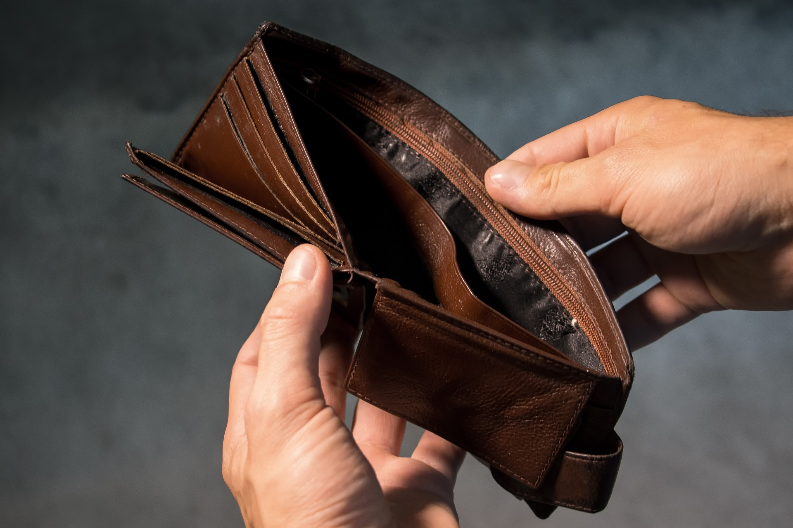

## Låna 1000 kr

Behöver du låna 1000 kr direkt? Kanske har du hittat ett klädesplagg som du bara måste ha, eller så kanske du behöver pengar till att täcka en oförutsedd utgift. Inga problem. Idag har många företag förmånliga erbjudanden på mindre snabblån och smslån till sina kunder. 1000 kr är dessutom en summa som de flesta kan beviljas och som går att låna utan någon säkerhet.

Låneföretagen ställer i regel inte heller krav på någon fast årsinkomst vid dessa lägre lånesummor och till skillnad från hos banker och andra institutioner behöver du aldrig svara på några frågor om vad pengarna ska användas till. Genom att vända dig till något av dessa företag slipper du långa ansökningstider och omfattande bakgrundskontroller.

### Hur ansöker jag om ett snabblån på 1000 kr?

Det är enkelt att ansöka om ett snabblån. För att kunna ansöka om ett litet lån på 1000 kr behöver du vanligtvis inte mer än ett svenskt personnummer och ett svenskt bankkonto. Ansökningen gör du antingen direkt på låneföretagets hemsida eller via sms. När du hittat ett lån på vår webbplats med villkor som passar dig klickar du dig vidare till låneföretagets hemsida och följer de instruktioner som finns där. Förutsatt att du ansöker under företagets öppettider kan de flesta långivare ge dig ett besked bara några minuter efter att du skickat in din ansökan. Om din ansökning blir beviljad utbetalas pengarna i stort sett direkt. Den vanligaste återbetalningstiden för att låna 1000 kr är precis som för andra mindre snabblån 30 dagar, men det finns också långivare som erbjuder längre återbetalningstider. Genom att betala tillbaka ditt lån inom 30 dagar kan du drastiskt minska räntan och kostnaderna för lånet.

### Värt att tänka på

Det har aldrig varit så enkelt att låna 1000 kr som det är idag. Tänk dock på att du bara ska ta ett lån om du är säker på att du kan återbetala den lånade summan i tid. Den vanligaste återbetalningstiden för ett mindre lån är som sagt 30 dagar. Även om vissa företag kan erbjuda längre återbetalningstider rekommenderar vi att du försöker betala tillbaka ditt lån så snabbt du kan för att undvika en högre räntekostnad. I de flesta fall är ett snabblån eller smslån på 1000 kr inte alls svårt att betala tillbaka inom en månad. Därför kan ett litet snabblån vara ett bra alternativ till att sitta hemma och vänta på att lönen ska dyka upp på kontot eller att låta en räkning ligga obetald och därmed riskera att drabbas av höga inkassoavgifter eller motta kravbrev. Hos oss hittar du ett stort antal företag hos vilka du kan låna 1000 kr redan idag, snabbt och utan krångel.

## Låna 3000 kr

Alla kan vara i behov av ett tillskott i kassan, oavsett om man vill unna sig själv något extra, behöver pengar till räkningar eller vill passa på att boka billiga flygbiljetter. För dig som inte vill sitta och vänta på nästa löneutbetalning är ett snabblån en utmärkt lösning i situationer som dessa. 3000 kr är en lånesumma som idag finns som erbjudande hos i stort sett alla snabblåneföretag.

För enkelhetens skull har vi samlat alla erbjudanden om snabblån och smslån på 3000 kr på vår hemsida. Här kan du jämföra de villkor och lånekostnader som gäller vid snabblån på 3000 kr hos de olika företagen för att på så vis känna dig säker på att du väljer rätt lån med förmånliga villkor.

### Hur lånar jag snabbt 3000 kr?

Snabblån är ett smidigt sätt att snabbt få in pengar direkt på ditt konto. Leta reda på ett lån och en långivare som passar just dig på vår hemsida och klicka sedan på länken till långivarens hemsida. För att snabbt låna 3000 kr behöver du bara fylla i ansökningsformuläret på den aktuella långivarens hemsida. Många gånger kan du också välja att skicka in din ansökan via sms. Du får nästan alltid besked direkt. Efter att din ansökan beviljats kommer 3000 kr att föras över till ditt konto redan inom några minuter. Tänk dock på att detta endast gäller när du ansöker om lån under det aktuella låneföretagets öppettider, annars kommer pengarna att utbetalas först nästa bankdag.

### Låna pengar redan idag

Om du snabbt behöver låna 3000 kr och är säker på att du kommer att kunna återbetala pengarna i tid är ett snabblån ett perfekt alternativ för dig. Genom att ta ett snabblån eller smslån kan du leva i nuet i stället för att sitta och vänta på nästa löneutbetalning. Många gånger är det dessutom fördelaktigt ur ett rent ekonomisk perspektiv att ta ett snabblån eller smslån för att exempelvis kunna betala räkningarna i tid och slippa ännu högre avgifter. Hos oss hittar du snabbt och smidigt all nödvändig information om de långivare som lånar ut 3000 kr och de villkor som gäller för dessa lån. Med vår tjänst kan du försäkra dig om att du alltid kommer att fatta ett smart beslut och att du väljer det lån som är bäst för dig.

## Låna 5000 kr

Letar du efter ett snabblåneföretag där du kan låna 5000 kr? Alla behöver vi låna pengar ibland. Det kan handla om att man har drabbats av en oförutsedd utgift eller att man vill unna sig själv en belöning i vardagen eller hitta på något roligt med nära och kära. Om du vet med dig att du kommer att ha pengar senare samma månad kan ett snabblån på 5000 kr vara något för dig.

Hos oss hittar du svenska företag som ger dig möjligheten att snabbt och enkelt låna 5000 kr utan att du behöver svara på frågor om vad pengarna ska användas till. Vi har sammanställt all information som du kan tänkas behöva om de olika långivarnas villkor och kostnader för att du enkelt ska kunna skapa dig en egen uppfattning om långivarna och deras erbjudanden. Enklare än så blir det inte.

### Hur ansöker jag om lånet?

Det finns många erbjudanden om lån på vår hemsida. Klicka på länken till det låneföretags hemsida vars erbjudande intresserar dig. Ansökningen om ett snabblån på 5000 kr kan du göra antingen via sms eller direkt på det aktuella företagets hemsida. Du anger vanligtvis bara mobilnummer, bankkontonummer, inkomst och eventuella skulder. I vissa fall kan du behöva ange ytterligare information. När du skickat in din ansökan gör långivaren en kreditprövning och om du ansöker under företagets öppettider får du i regel besked direkt. Därefter dröjer det oftast bara några minuter innan summan på 5000 kr sätts in på ditt konto.

### Välj ett lån som passar just dig

Det finns mängder av aktörer i branschen som erbjuder olika villkor vid lån på 5000 kr. Försök därför hitta ett företag som erbjuder ett lån som passar dig och din ekonomi. Fråga dig själv hur snabbt du kommer att kunna betala tillbaka pengarna om du lånar 5000 kr och välj en långivare som erbjuder det bästa alternativet utifrån just din ekonomiska situation. Tänk på att alla långivare gör en snabb kreditupplysning och bedömning av din ekonomi. På så vis kan du som beviljas ett lån på 5000 kr också känna dig trygg i att du kommer att ha goda möjligheter att återbetala ditt lån i enlighet med företagets lånevillkor. Jämför lånevillkoren och kostnaderna hos ett stort antal låneföretag på vår hemsida och välj ett lån som det är realistiskt att du kan bli beviljad och återbetala.

## Låna 10 000 kr

Behöver du ett stort lån redan idag? Även om de flesta erbjudandena om snabblån avser lägre summor så finns det också flera företag som inriktar sig på snabblån och som låter dig låna 10000 kr. Det finns dessutom flera låneföretag som erbjuder lån på 10000 kr även till sina nya kunder. På vår hemsida hittar du dessa företag och du kan också jämföra de olika lånevillkoren för att hitta ett lån som passar just dig.

### Bli beviljad

Hur svårt det är att bli beviljad ett lån beror i första hand på hur din ekonomi ser ut och hur stor summa du önskar låna. För att kunna låna 10000 kr kräver många företag att du har en stabil ekonomi och i många fall en fast inkomst. Företagen gör en kreditprövning för att avgöra om du kommer ha möjlighet att återbetala lånet. Vad företagen framför allt tar hänsyn till är din nuvarande ekonomiska situation och eventuella andra lån och skulder.

### Hur lånar jag 10 000 kr idag?

Förutsatt att du hittar en långivare vars krav du uppfyller är det enkelt att ansöka om ett lån på 10000 kr. När du hittat ett företag med ett erbjudande som du är intresserad av klickar du på länken till företagets hemsida. Du fyller i din ansökan i form av ett formulär på låneföretagets hemsida och i vissa fall går det även att ansöka om lånet via sms. De personuppgifter du anger vid din ansökan varierar från företag till företag, men vanligtvis ingår uppgifter likt personnummer, kontonummer, inkomst och eventuella nuvarande skulder. Om du skickar in din ansökan när företagets kundservice har öppet kan du oftast få besked redan efter några minuter. Beviljas din låneansökan kan du i regel vänta dig att ha lånesumman 10000 kr på ditt konto redan inom en kvart.

### Vad bör jag tänka på?

Ett snabblån är ett lån som ska återbetalas på kortare tid än vanliga lån, vanligtvis inom 30 – 90 dagar. Förutsatt att du återbetalar ditt lån i tid behöver du inte oroa dig över några skenande räntekostnader eller oförutsedda avgifter. Dessutom varierar den ränta du betalar beroende på hur lång återbetalningstid du väljer. Fråga därför dig själv hur snabbt du kommer att kunna betala tillbaka ett lån på 10000 kr och hur mycket du är beredd att betala i räntekostnader för detta lån. Kortare återbetalningstid innebär alltid sänkta räntekostnader. Försök därför att välja en kort återbetalningstid, men det gäller samtidigt att du är realistisk när du väljer återbetalningstid så att du faktiskt har möjlighet att återbetala ditt lån i tid och slipper onödiga tilläggskostnader.